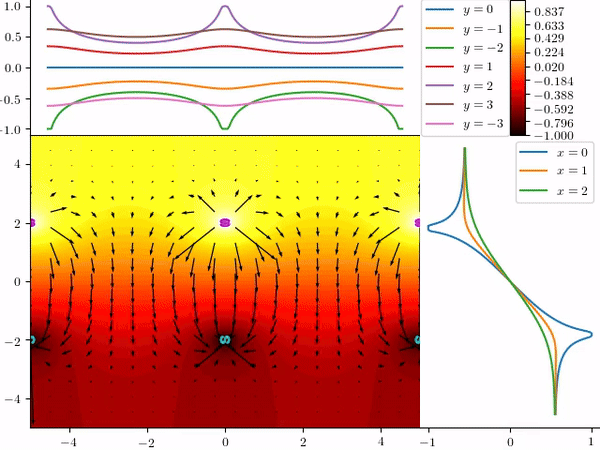

# Model Analysis - Final Project
Code and report for the final project for Model Analysis course at the Faculty of Mathematics and Physics, University of Ljubljana.

## Problem Statement
Calculate the potential and the electric field for the case of a one dimensional periodic arrangement of electrodes using the boundary element method (assume two dimensional physics). 
Periodicity of the problem changes the Green's function into an infinite sum of individual contributions. Analytically investigate the convergence properties of the resulting series and find a way for its summation.

    

